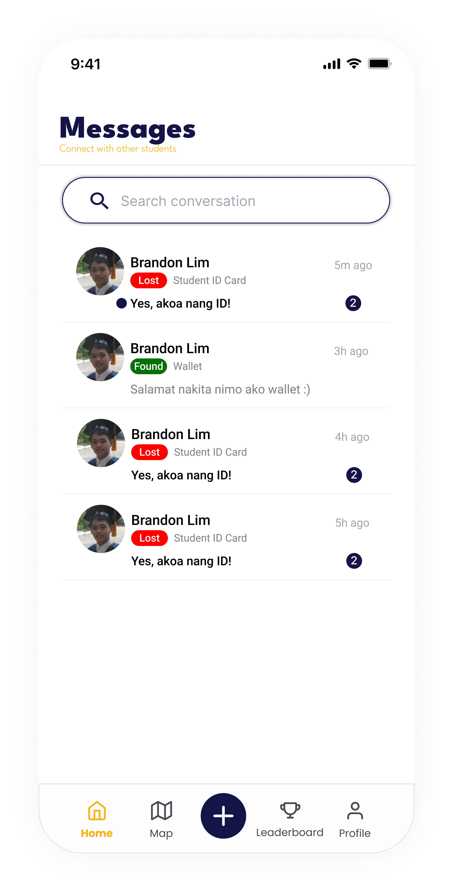
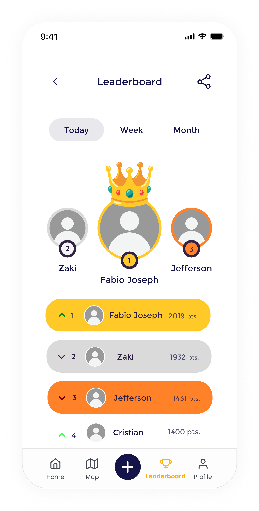

# 🎯 iFound

**iFound: A Gamified Mobile Lost and Found System with Peer-to-Peer Communication and Campus Map Integration for USTP Students**

---

## 📖 Overview

**iFound** is a Flutter-based mobile application designed to help **USTP students** easily **report, locate, and recover lost items** within the campus.  
It integrates a **gamified system** to encourage user participation, **real-time peer-to-peer communication**, and a **campus map** for better navigation and item tracking.

---

## 🚀 Key Features

- 🎮 **Gamification System** – Earn points or rewards for returning lost items or helping others.  
- 🗺️ **Campus Map Integration** – Visualize item locations directly on the USTP campus map.  
- 💬 **Peer-to-Peer Messaging** – Chat directly with the finder or owner for quick coordination.  
- 📸 **Item Reporting** – Post lost or found items with detailed descriptions and images.  
- 🔐 **Secure Login** – Firebase Authentication for account security.  
- ☁️ **Real-Time Updates** – Powered by Firebase Cloud Firestore.

---

## 🧰 Tech Stack

| Category | Technology |
|-----------|-------------|
| Framework | [Flutter](https://flutter.dev/) |
| Language | Dart |
| Backend | [Firebase](https://firebase.google.com/) |
| Authentication | Firebase Auth |
| Database | Cloud Firestore |
| Maps Integration | Google Maps API |

---

## 📱 Screenshots

  
   
   
   
   
   
   
   
   
   

